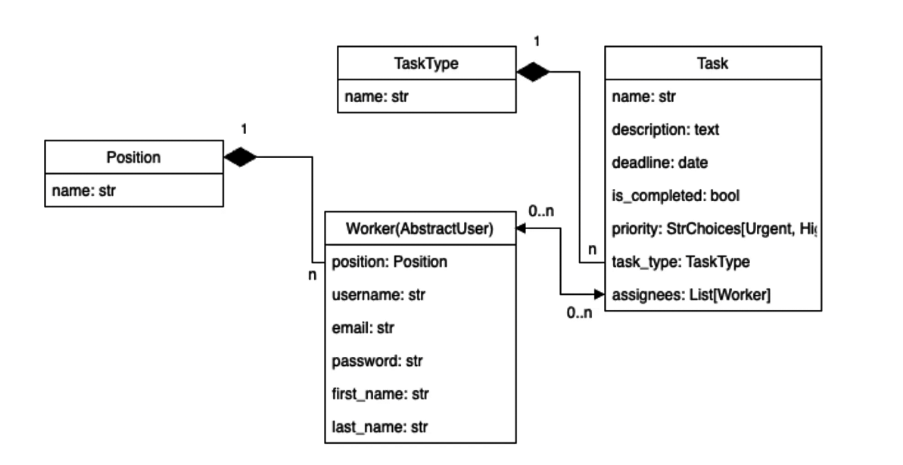
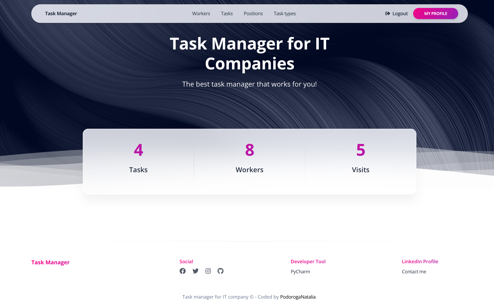

# IT Company Task Manager

A task manager which ensures task control and communication between team members at all stages of project development.

## Installing / Getting started

Python3 must be already installed

```
git clone git@github.com:PodorogaNatalia/it-company-task-manager.git
cd it_company_task_manager
python -m venv venv
Windows: venv\Scripts\activate
Linux, Unix: source venv/bin/activate
pip install -r requirements.txt
python manage.py runserver
```

## Features

* Unregistered user does not have access to view website pages.
* Registered users can create, update and delete Task, Task type, Position and Workers.
* Registered user can add himself to the Task and delete from it.
* Registered user can mark the Task as done.
* Users can use the search form on Task, Workers, Positions, Task types pages.
* Registered users can track the number of their visits the main page of the project.

## DB Structure



## Home-page example


